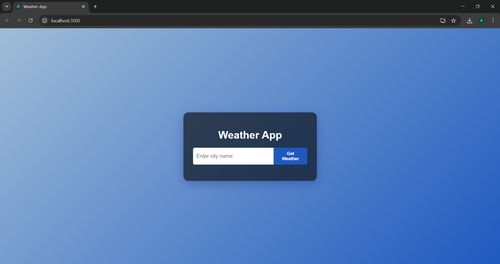
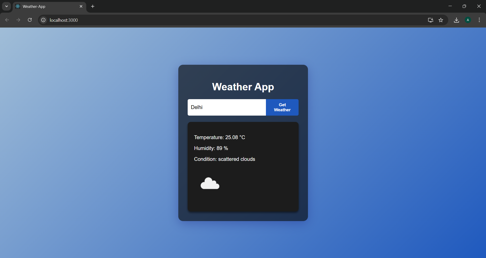

# 🌦️ WeatherApp

WeatherApp is a simple full-stack application that provides real-time weather information using a **Spring Boot backend** and **React frontend**.  
It fetches live data from the **OpenWeatherMap API** and displays it in a clean, responsive card format.

---

## ✨ Features

- 🔍 Search current weather by **city name**
- 🌡️ Display **temperature, humidity, and weather description**
- 🖼️ Show **weather condition icons** from OpenWeatherMap
- 📱 **Responsive UI** built with React

---

## 🛠️ Technology Stack

- **Backend:** Java Spring Boot  
- **Frontend:** React.js  
- **API:** OpenWeatherMap API  

---

## ⚙️ Setup & Installation

### Backend (Spring Boot)

1. Clone the repository  
   ```bash
   git clone https://github.com/magnetar27/Weather-App
   cd weatherapp/weatherapp
   ```

2. Get your API key from [OpenWeatherMap](https://openweathermap.org/api).

3. Add your API key inside `src/main/resources/application.properties`:  
   ```properties
   weather.api.key=YOUR_API_KEY_HERE
   ```

4. Run the Spring Boot application:  
   ```bash
   ./mvnw spring-boot:run
   ```

---

## 📸 Screenshots




---

### Frontend (React)

1. Navigate to the frontend folder:  
   ```bash
   cd weatherapp-frontend
   ```

2. Install dependencies:  
   ```bash
   npm install
   ```

3. Start the React app:  
   ```bash
   npm start
   ```

---

## 🚀 Usage

1. Open your browser and go to:  
   ```
   http://localhost:3000
   ```
2. Enter a city name.  
3. View the **current weather status** displayed in a card.  

---

## ⚡ Notes

- Ensure the backend is running on **port 8080**.  
- In `package.json`, set the `proxy` field as:  
  ```json
  "proxy": "http://localhost:8080"
  ```
- Free OpenWeatherMap API keys have usage limits.  

---

## 📜 License

This project is licensed under the **MIT License**.

---

Made with ❤️ by [Amaan Siddiqui]
